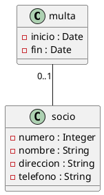
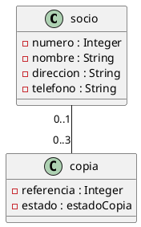
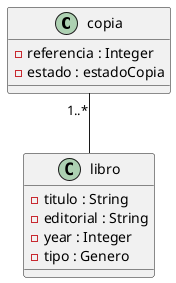
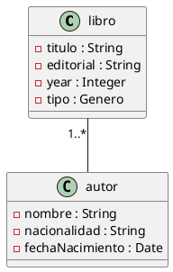

#Biblioteca
###Multa(0..1) - socio
#####UML


#####Java
```java

public class multa {
    private String inicio;
    private String fin;
}
    public multa(String inicio) {
        this.inicio = inicio;
    }
    public String getInicio() {
        return inicio;
    }
    public String getFin() {
        return fin;
    }
    public void setInicio(String inicio) {
        this.inicio = inicio;
    }

    public void setFin(String fin) {
        this.fin = fin;
    }
    
public class socio {
    private int numero;
    private String nombre;
    private String direccion;
    private String telefono;
}
    public socio(int numero, String nombre, String direccion, String telefono) {
        this.numero = numero;
        this.nombre = nombre;
        this.direccion = direccion;
        this.telefono = telefono;
    }
    public int getNumero() {
        return numero;
    }
   
    public String getNombre() {
        return nombre;
    }
   
    public String getDireccion() {
        return direccion;
    }
  
    public String getTelefono() {
        return telefono;
    }
    

    public void setNumero(int numero) {
        this.numero = numero;
      
    }

    public void setNombre(String nombre) {
        this.nombre = nombre;
    
    }

    public void setDireccion(String direccion) {
        this.direccion = direccion;
       
    }

    public void setTelefono(String telefono) {
        this.telefono = telefono;
      
    }
```
###Socio(0..1) - Copia(0..3)
#####UML


#####Java
```java

public class socio {
    private int numero;
    private String nombre;
    private String direccion;
    private String telefono;
}
    public socio(int numero, String nombre, String direccion, String telefono) {
        this.numero = numero;
        this.nombre = nombre;
        this.direccion = direccion;
        this.telefono = telefono;
    }
    public int getNumero() {
        return numero;
    }

    public String getNombre() {
        return nombre;
    }

    public String getDireccion() {
        return direccion;
    }

    public String getTelefono() {
        return telefono;
    }


    public void setNumero(int numero) {
        this.numero = numero;

    }

    public void setNombre(String nombre) {
        this.nombre = nombre;

    }

    public void setDireccion(String direccion) {
        this.direccion = direccion;

    }

    public void setTelefono(String telefono) {
        this.telefono = telefono;

    }
    
public class copia {
    int referencia;
    private Class estadoCopia;
}
    public copia(int referencia) {
        this.referencia = referencia;
    }
    public int getReferencia() {
        return referencia;
    }
    
    public void setReferencia(int referencia) {
        this.referencia = referencia;
    }
```
###Prestamo - Socio
#####UML
```plantuml

@startuml

class prestamo {
-inicio : Date
-fin : Date
}

class socio {
-numero : Integer
-nombre : String
-direccion : String
-telefono : String
}

(copia, socio) ... prestamo : recibe
@enduml
```

#####Java
```java

public class prestamo {
    private String inicio;
    private String fin;
}
    public prestamo(String inicio, String fin) {
        this.inicio = inicio;
        this.fin = fin;
    }
    public String getInicio() {
        return inicio;
    }
    
    public String getFin() {
        return fin;
    }
  
    public void setInicio(String inicio) {
        this.inicio = inicio;
        
    }

    public void setFin(String fin) {
        this.fin = fin;
        
    }
    
public class socio {
    private int numero;
    private String nombre;
    private String direccion;
    private String telefono;
}
    public socio(int numero, String nombre, String direccion, String telefono) {
        this.numero = numero;
        this.nombre = nombre;
        this.direccion = direccion;
        this.telefono = telefono;
    }
    public int getNumero() {
        return numero;
    }

    public String getNombre() {
        return nombre;
    }

    public String getDireccion() {
        return direccion;
    }

    public String getTelefono() {
        return telefono;
    }


    public void setNumero(int numero) {
        this.numero = numero;

    }

    public void setNombre(String nombre) {
        this.nombre = nombre;

    }

    public void setDireccion(String direccion) {
        this.direccion = direccion;

    }

    public void setTelefono(String telefono) {
        this.telefono = telefono;

    }
```
###Prestamo - Copia
#####UML
```plantuml

@startuml

class prestamo {
-inicio : Date
-fin : Date
}

class copia {
-referencia : Integer
-estado : estadoCopia
}

(copia, socio) ... prestamo : recibe
@enduml
```

#####Java
```java

public class prestamo {
    private String inicio;
    private String fin;
}
    public prestamo(String inicio, String fin) {
        this.inicio = inicio;
        this.fin = fin;
    }
    public String getInicio() {
        return inicio;
    }

    public String getFin() {
        return fin;
    }

    public void setInicio(String inicio) {
        this.inicio = inicio;

    }

    public void setFin(String fin) {
        this.fin = fin;

    }
public class copia {
    private int referencia;
}
    public copia(int referencia) {
        this.referencia = referencia;
    }
    
    public int getReferencia() {
        return referencia;
    }
    
    public void setReferencia(int referencia) {
        this.referencia = referencia;
       
    }
```
###Copia(0..1) - Libro
#####UML


#####Java
```java

public class copia {
    private int referencia;
}
    public copia(int referencia) {
        this.referencia = referencia;
    }
    public int getReferencia() {
        return referencia;
    }
    public copia(int referencia) {
        this.referencia = referencia;
    }
    public void setReferencia(int referencia) {
        this.referencia = referencia;
    }

public class libro {
    private String titulo;
    private int año;
    private String editorial;
    private String tipo;
}
   
    public libro(String titulo) {
        this.titulo = titulo;
    }
   
    public String getTitulo() {
        return titulo;
    }
    
    public int getAño() {
        return año;
    }
   
    public String getEditorial() {
        return editorial;
    }
   
    public String getTipo() {
        return tipo;
    }
   
    public void setTitulo(String titulo) {
        this.titulo = titulo;
    }

    public void setAño(int año) {
        this.año = año;
    }

    public void setEditorial(String editorial) {
        this.editorial = editorial;
    }

    public void setTipo(String tipo) {
        this.tipo = tipo;
    }

```
###Libro(0..1) - Autor
#####UML


#####Java
```java

public class libro {
    private String titulo;
    private int año;
    private String editorial;
    private String tipo;
}
    public libro(String titulo) {
        this.titulo = titulo;
    }
  
    public String getTitulo() {
        return titulo;
    }
    
    public int getAño() {
        return año;
    }
    
    public String getEditorial() {
        return editorial;
    }
    
    public String getTipo() {
        return tipo;
    }
    
    public void setTitulo(String titulo) {
        this.titulo = titulo;
    }

    public void setAño(int año) {
        this.año = año;
    }

    public void setEditorial(String editorial) {
        this.editorial = editorial;
    }

    public void setTipo(String tipo) {
        this.tipo = tipo;
    }
    
public class autor {
    private String nombre;
    private String fecha_nacimiento;
    private String nacionalidad;
}
    public autor(String nombre, String fecha_nacimiento, String nacionalidad) {
        this.nombre = nombre;
        this.fecha_nacimiento = fecha_nacimiento;
        this.nacionalidad = nacionalidad;
    }
    
    public String getNombre() {
        return nombre;
    }
   

    public String getFecha_nacimiento() {
        return fecha_nacimiento;
    }
    
    public String getNacionalidad() {
        return nacionalidad;
    }
   
    public void setNombre(String nombre) {
        this.nombre = nombre;
        
    }

    public void setFecha_nacimiento(String fecha_nacimiento) {
        this.fecha_nacimiento = fecha_nacimiento;
        
    }

    public void setNacionalidad(String nacionalidad) {
        this.nacionalidad = nacionalidad;
        
    }
```