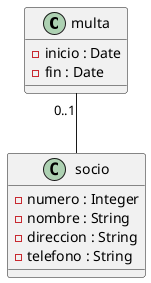
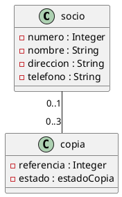
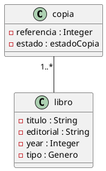
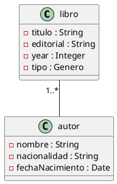

#Biblioteca
###Multa(0..1) - socio
#####UML


#####Java
```java

public class multa {
    private String inicio;
    private String fin;
}

public class socio {
    private int numero;
    private String nombre;
    private String direccion;
    private String telefono;
}

```
###Socio(0..1) - Copia(0..3)
#####UML


#####Java
```java

public class socio {
    private int numero;
    private String nombre;
    private String direccion;
    private String telefono;
}

public class copia {
    int referencia;
    private Class estadoCopia;
}
```
###Prestamo - Socio
#####UML
```plantuml

@startuml

class prestamo {
-inicio : Date
-fin : Date
}

class socio {
-numero : Integer
-nombre : String
-direccion : String
-telefono : String
}

(copia, socio) ... prestamo : recibe
@enduml
```

#####Java
```java

public class prestamo {
    private String inicio;
    private String fin;
}

public class socio {
    private int numero;
    private String nombre;
    private String direccion;
    private String telefono;
}
```
###Prestamo - Copia
#####UML
```plantuml

@startuml

class prestamo {
-inicio : Date
-fin : Date
}

class copia {
-referencia : Integer
-estado : estadoCopia
}

(copia, socio) ... prestamo : recibe
@enduml
```

#####Java
```java

public class prestamo {
    private String inicio;
    private String fin;
}

public class copia {
    private int referencia;
}
```
###Copia(0..1) - Libro
#####UML


#####Java
```java

public class copia {
    private int referencia;
}

public class libro {
    private String titulo;
    private int año;
    private String editorial;
    private String tipo;
}
```
###Libro(0..1) - Autor
#####UML


#####Java
```java

public class libro {
    private String titulo;
    private int año;
    private String editorial;
    private String tipo;
}

public class autor {
    private String nombre;
    private String fecha_nacimiento;
    private String nacionalidad;

}

```