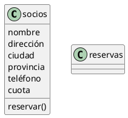
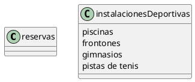
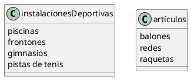
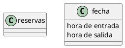

#Polideportivo
###Socios(0..n) - Reservas(0..n)
#####UML


#####Java
```java
public class socios {

    private String nombre;
    private String direccion;
    private String ciudad;
    private String provincia;
    private String telefono;
    private int cuota;
    reservar();
}

public class reservas {
}

```

###Reservas(1) - instalacionesDeportivas(1)
#####UML


#####Java
```java
public class reservas {
}

public class instalacionesDeportivas {
    private Arrays<instalacion> piscinas;
    private Arrays<instalacion> frontones;
    private Arrays<instalacion> gimnasios;
    private Arrays<instalacion> pistasDeTenis;
}
```

###instalacionesDeportivas(1) - Articulos(0..n)
#####UML


#####Java
```java
public class instalacionesDeportivas {
    private Arrays<instalacion> piscinas;
    private Arrays<instalacion> frontones;
    private Arrays<instalacion> gimnasios;
    private Arrays<instalacion> pistasDeTenis;
}

public class articulos {
    private int balones;
    private int redes;
    private int raquetas;
}

```

###Reservas(1) - Fecha(1)
#####UML


#####Java
```java
public class reservas {
}

public class fecha {
    private String horaDeEntrada;
    private String horaDeSalida;
}
```

