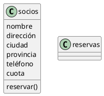
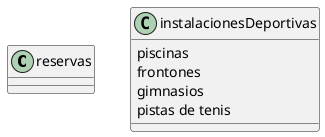
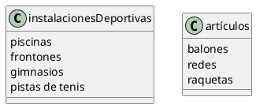
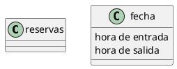

#Polideportivo
###Socios(0..n) - Reservas(0..n)
#####UML


#####Java
```java
public class socios {

    private String nombre;
    private String direccion;
    private String ciudad;
    private String provincia;
    private String telefono;
    private int cuota;
    reservar();
}

public class reservas {
}
    public String getNombre() {
        return nombre;
    }

    public String getDireccion() {
        return direccion;
    }

    public String getCiudad() {
        return ciudad;
    }

    public String getProvincia() {
        return provincia;
    }

    public String getTelefono() {
        return telefono;
    }

    public int getCuota() {
        return cuota;
    }

    public void setNombre(String nombre) {
        this.nombre = nombre;
    }

    public void setDireccion(String direccion) {
        this.direccion = direccion;
    }

    public void setCiudad(String ciudad) {
        this.ciudad = ciudad;
    }

    public void setProvincia(String provincia) {
        this.provincia = provincia;
    }

    public void setTelefono(String telefono) {
        this.telefono = telefono;
    }

```

###Reservas(1) - instalacionesDeportivas(1)
#####UML


#####Java
```java
public class reservas {
}

public class instalacionesDeportivas {
    private Arrays<instalacion> piscinas;
    private Arrays<instalacion> frontones;
    private Arrays<instalacion> gimnasios;
    private Arrays<instalacion> pistasDeTenis;
}
    public Arrays<instalacion> getPiscinas() {
        return piscinas;
    }

    public Arrays<instalacion> getFrontones() {
        return frontones;
    }

    public Arrays<instalacion> getGimnasios() {
        return gimnasios;
    }

    public Arrays<instalacion> getPistasDeTenis() {
        return pistasDeTenis;
    }

    public void setPiscinas(Arrays<instalacion> piscinas) {
        this.piscinas = piscinas;
    }

    public void setFrontones(Arrays<instalacion> frontones) {
        this.frontones = frontones;
    }

    public void setGimnasios(Arrays<instalacion> gimnasios) {
        this.gimnasios = gimnasios;
    }

    public void setPistasDeTenis(Arrays<instalacion> pistasDeTenis) {
        this.pistasDeTenis = pistasDeTenis;
    }
```

###instalacionesDeportivas(1) - Articulos(0..n)
#####UML


#####Java
```java
public class instalacionesDeportivas {
    private Arrays<instalacion> piscinas;
    private Arrays<instalacion> frontones;
    private Arrays<instalacion> gimnasios;
    private Arrays<instalacion> pistasDeTenis;
}

    public Arrays<instalacion> getPiscinas() {
        return piscinas;
    }

    public Arrays<instalacion> getFrontones() {
        return frontones;
    }

    public Arrays<instalacion> getGimnasios() {
        return gimnasios;
    }

    public Arrays<instalacion> getPistasDeTenis() {
        return pistasDeTenis;
    }

    public void setPiscinas(Arrays<instalacion> piscinas) {
        this.piscinas = piscinas;
    }

    public void setFrontones(Arrays<instalacion> frontones) {
        this.frontones = frontones;
    }

    public void setGimnasios(Arrays<instalacion> gimnasios) {
        this.gimnasios = gimnasios;
    }

    public void setPistasDeTenis(Arrays<instalacion> pistasDeTenis) {
        this.pistasDeTenis = pistasDeTenis;
    }
    
public class articulos {
    private int balones;
    private int redes;
    private int raquetas;
}
    public int getBalones() {
        return balones;
    }

    public int getRedes() {
        return redes;
    }

    public int getRaquetas() {
        return raquetas;
    }

    public void setBalones(int balones) {
        this.balones = balones;
    }

    public void setRedes(int redes) {
        this.redes = redes;
    }

    public void setRaquetas(int raquetas) {
        this.raquetas = raquetas;
    }
```

###Reservas(1) - Fecha(1)
#####UML


#####Java
```java
public class reservas {
}

public class fecha {
    private String horaDeEntrada;
    private String horaDeSalida;
}
    public String getHoraDeEntrada() {
        return horaDeEntrada;
    }

    public String getHoraDeSalida() {
        return horaDeSalida;
    }

    public void setHoraDeEntrada(String horaDeEntrada) {
        this.horaDeEntrada = horaDeEntrada;
    }

    public void setHoraDeSalida(String horaDeSalida) {
        this.horaDeSalida = horaDeSalida;
    }
```

